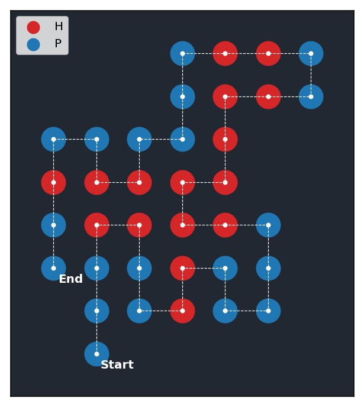
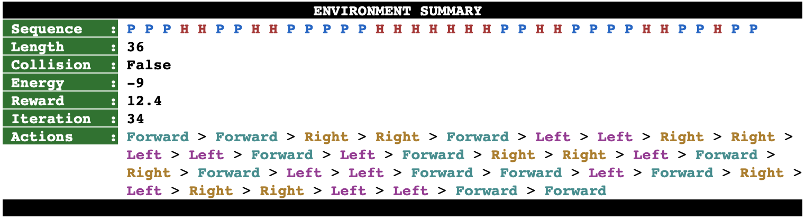

# Protein Folding Problem : A Reinforcement Learning Approach

## Description

The following is an AI project that aims to solve a simplified version of the Protein Folding Problem using Reinforcement Learning. The Protein Folding Problem is concerned with finding the *Native State* of a protein given its sequence of amino-acids. When a protein is synthesized, it folds rapidly in the space until it reaches a stable form, usually referred to as the Native State. After this, the protein can occupy its intended function. 

Knowing the outcome of the folding process in advance is one of the major challenges in Bioinformatics, and solving it would have important implications in several domains ranging form biochemistry to genetic engineering.

For a more detailed description of the problem, the task formulation and the proposed solution, check out the [paper](report/Protein Folding Problem - A Reinforcement Learning Approach.pdf) !

## Research Questions

Through this project, we will try to answer the following questions :

* How can we cast the problem as a combinatorial optimization task ?
* How do we frame the task from a Reinforcement Learning perspective ? What is the State Space, Action Space and Reward Function ?
* How viable is Reinforcement Learning in solving the Protein Folding Problem ?

##  Setup

## Preview

