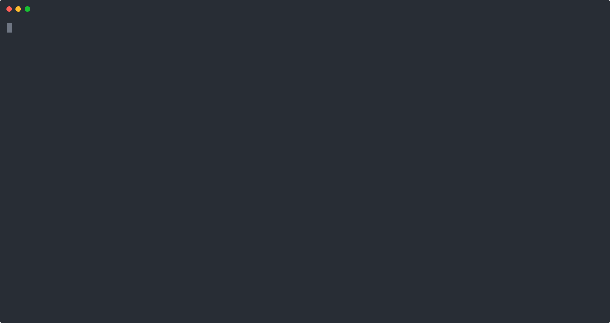

# Protein Structure Prediction : A Reinforcement Learning Approach

## I. Description

The following is an AI project that aims to solve a simplified version of the Protein Structure Prediction (PSP) problem using Reinforcement Learning. The Protein Structure Prediction problem is concerned with finding the *Native State* of a protein given its sequence of amino-acids. When a protein is synthesized, it folds rapidly in the space until it reaches a stable form, usually referred to as the Native State. After this, the protein can occupy its intended function. 

Knowing the outcome of the folding process in advance is one of the major challenges in Bioinformatics, and solving it would have important implications in several domains ranging form biochemistry to genetic engineering.

For a more detailed description of the problem, the task formulation and the proposed solution, check out the project's [paper](https://github.com/SAMY-ER/Protein-Folding-Problem/blob/master/report/Protein%20Folding%20Problem%20-%20A%20Reinforcement%20Learning%20Approach.pdf) !

## II. Research Questions

Through this project, we will try to answer the following questions :

* How can we cast the problem as a combinatorial optimization task ?
* How do we frame the task from a Reinforcement Learning perspective ? What is the State Space, Action Space and Reward Function ?
* How viable is Reinforcement Learning in solving the PSP problem ?

##  III. Installation

In order to install and run this module, complete the following steps. 

1. Create a virtual environment (this step is optional):

+ **Using virtualenv**
```
>> mkdir ~/envs
>> python -m venv ~/envs/pfpenv
>> source ~/envs/pfpenv/bin/activate
``` 
Which creates the folder envs first, then the environment pfpenv and activates it.

+ **Using conda envs**
```
>> conda create --name pfpenv
>> conda activate pfpenv
```

2. Install requirements:
```
>> cd path/to/Protein-Folding-Problem
>> pip install -r requirements.txt
```

3. Run setup.py:
```
>> pip install .
```

## IV. Usage



## V. Components

This section describes the different components of the module :

1. The environment
2. The agents
3. The data

We first design and implement a Reinforcement Learning Environment for the Protein Folding Problem, then we create the different RL agents we want to experiment with.

### 1. Environment

The Environment is based on a simple protein abstraction that makes computations tractable. The idea is to represent the protein in a 2D grid (as opposed to a 3D space), and classify the different amino-acids that constiture its sequence. Here, we use the 2D Hydrophobic-Polar (HP) Lattice model introduced by Lau et al. in 1989 [1]. The classification of amino-acids in this model is based on the assumption that hydrophobicity is responsible for the generation of important forces that steer the folding process. Thus, amino-acids are classified into two categories : Hydrophobic (or Non-Polar) denoted by H, and Hydrophilic (or Polar) denoted by P. The folding process within the lattice can be thought of as placing amino-acids from the sequence, one after the other, to form a chain. We also assume that the folding process obeys the Thermodynamic Principle : the Native State is characterized by a minimum level of Gibbs Free Energy, and that the information required to determine its structure is entirely encoded in the sequence of amino-acids. Equipped with these assumptions, the objective is to form a chain on the lattice that minimizes the energy.

With this in mind, we can define our RL environment to solve our problem, cast as combinatorial optimization task. Given a protein sequence `P` of length `n`, the State Space would be the set of configurations of amino-acids in the lattice, and the Action Space would represent the possible positions to place the next amino-acid on the grid. Finally, we design the reward function to reward valid placements of amino-acids (i.e that do not result in a collision), and if we successfully terminate the episode, we reward the agent by the negative energy of the resulting configuration. An episode starts by placing the first (actually first two) amino-acid in the grid, and terminates either when we hit a collision or when we place all of the amino-acids. Refer to the [paper](./report/Protein%20Folding%20Problem%20-%20A%20Reinforcement%20Learning%20Approach.pdf) to know more.

The file `pfp/env.py` implements this environment by extending the base environment class offered by the package `gym` from OpenAI. The figure below shows an example of a successful configuration of the protein sequence `PPPHHPPHHPPPPPHHHHHHHPPHHPPPPHHPPHPP` obtained by rendering the state of the environment after running a trained RL agent on it. On top of the image, we also display a summary of the environment.

<p align="center">
  
</p>

<div style="text-align:center"></div>
<div style="text-align:center"></div>

### 2. Agents

We implement several RL agents to attempt to solve this Protein Folding Problem. For now, these include:

1. Q-Learning
2. Deep Q-Network (DQN) [2]
3. Double Deep Q-Network (DDQN) [3]

All implementations are developed from scratch using `Tensorflow` and `Keras`for neural networks.

### 3. Data

To evaluate the performance of our proposed method, we need labeled data: protein sequences with their corresponding optimal level of energy. The data folder includes a csv file containing such data, retrieved from http://www.bioinf.uni-freiburg.de. 

## VI. References

[1] Lau, Kit Fun and Ken A Dill (1989). “A lattice statistical mechanics model of the conformational and sequence spaces of proteins”. In: Macromolecules 22.10, pp. 3986–3997.

[2] Mnih, Volodymyr, et al. "Playing atari with deep reinforcement learning." arXiv preprint arXiv:1312.5602 (2013).

[3] Van Hasselt, Hado, Arthur Guez, and David Silver. "Deep reinforcement learning with double q-learning." Thirtieth AAAI Conference on Artificial Intelligence. 2016.